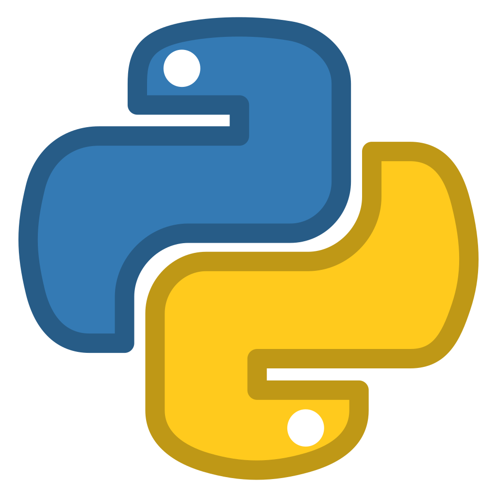
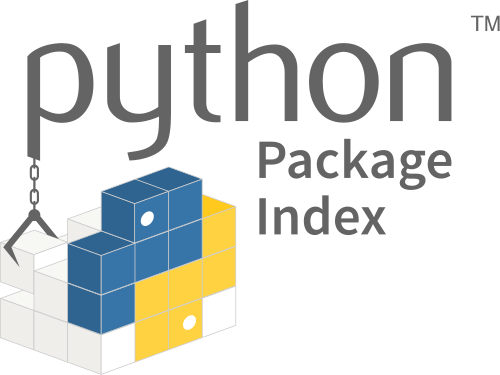

# Tutoria de Python para Análise de Dados - BRISA

## Descrição

&emsp;&emsp;Repositório destinado a ser uma tutoria de Python para o projeto BRISA. O leitor será introduzido a linguagem e bibliotecas relevantes a análise de dados (Pandas, Numpy e MatPlotlib), além de tecnologias que aumentarão a eficiência na criação de um projeto.

## Introdução Python

<div align="center">

</div>

- ### Descrição

&emsp;&emsp;Python é uma linguagem de programação de alto nível, dinâmica, interpretada, modular, multiplataforma e que suporta uma arquitetura orientada a objetos.

&emsp;&emsp;Por ser uma linguagem de sintaxe relativamente simples e de fácil compreensão, ganhou popularidade entre profissionais da indústria tecnológica que não são especificamente programadores, como engenheiros, matemáticos, cientistas de dados, pesquisadores e outros. 

&emsp;&emsp;Python é uma linguagem poderosa, possui uma grande comunidade e uma vasta quantidade de bibliotecas, o que faz com que essa seja uma linguagem muito versátil e de fácil aprendizado devido ao grande número de documentações. A seguir estão algumas dass principais áreas onde o Python é utilizado:

<br>

&emsp;&emsp;1 - Scripting e automação: Algumas das bibliotecas para essa área são [Pywin32](https://wiki.python.org.br/PyWin32) e [Selenium](https://www.selenium.dev/pt-br/documentation/);

&emsp;&emsp;2 - Desenvolvimento web: A linguagem possui uma extensa variedade de frameworks para todos os tipos de gosto, entre eles os famosos [Django](https://docs.djangoproject.com/pt-br/4.2/), [Flask](https://flask.palletsprojects.com/en/2.3.x/) e [FastAPI](https://pythonacademy.com.br/blog/como-usar-o-fastapi-para-construir-apis-no-python#:~:text=O%20FastAPI%20%C3%A9%20uma%20biblioteca%20Python%20que%20permite,APIs%20seguras%2C%20documentadas%20e%20test%C3%A1veis%20de%20maneira%20eficiente.);
    
&emsp;&emsp;3 - Enquadramento de testes: Isso justifica por que desenvolvedores de software em Python adoram utilizar TDD (Test Driven Development). Para mais informações sobre essa técnica, acesse [TDD](https://kenzie.com.br/blog/o-que-e-tdd/);
    
&emsp;&emsp;4 - Big Data: Para essa área o Python tem como a principal biblioteca o [Pandas](https://pandas.pydata.org/docs/);
    
&emsp;&emsp;5 - Ciência de dados: Nesse tutorial iremos focar nessa área, onde vamos conhecer as bibliotecas [Pandas](https://pandas.pydata.org/docs/), [NumPy](https://numpy.org/doc/stable/) e [MatPlot](https://matplotlib.org/stable/index.html);
    
&emsp;&emsp;6 - Computação gráfica: Pacotes de soluções para esta área, como [PyOpenGL](https://pyopengl.sourceforge.net/documentation/) e [PyGame](https://www.pygame.org/docs/);
    
&emsp;&emsp;7 - Inteligência artificial: Entre as bibliotecas mais comuns voltadas ao aprendizado de máquina estão o [TensorFlow](https://www.tensorflow.org/about/bib?hl=pt-br), [PyThorch](https://pytorch.org/docs/stable/index.html), [Theano](https://theano.readthedocs.io/en/0.8.x/), [Keras](https://keras.io/getting_started/).

</br>

- ### Vantagens

    - É fácil de aprender

    - É portátil e multiplataforma

    - É open source e gratuito

    - Oferece múltiplas possibilidades de desenvolvimento

    - É uma linguagem “curinga”

</br>

- ### Desvantagens

    - Aplicações que lidam diretamente com o hardware

    - Aplicações onde o hardware não é escalável
    
    - Aplicações de missões críticas que processam dados em tempo real
    
    - Aplicações nativas com interfaces gráficas
    
    - Aplicações com vida útil muito longa  

</br>

- ### Instalação

     - **Linux**

        - Red Hat, CentOS, or Fedora
            ```
            dnf install python3 python3-devel
            ```

        - Debian or Ubuntu
            ```
            apt-get install python3 python3-dev
            ```
        
        - Gentoo
            ```
            emerge dev-lang/python
            ```

        - Arch Linux
            ```
            pacman -S python3
            ```

     - **Windows**

&emsp;&emsp;Para fazer o Download do Python para Windows acesse o site [Python Download](https://www.python.org/downloads/)

<br>

## Introdução PyPI e pip

<div align="center">

</div>
    
- ### Descrição

&emsp;&emsp;O PyPI é um repositório centralizado que hospeda milhares de pacotes de software desenvolvidos pela comunidade Python. Ele permite que os desenvolvedores compartilhem suas bibliotecas, frameworks e ferramentas com outros usuários do Python em todo o mundo. O PyPI desempenha um papel fundamental na promoção do compartilhamento e da colaboração dentro da comunidade Python.

&emsp;&emsp;O PyPI possui uma [interface da web](https://pypi.org/) que permite aos desenvolvedores pesquisar e explorar pacotes disponíveis. Você pode procurar por palavras-chave, categorias ou nome do pacote. Além disso, você pode obter informações detalhadas sobre um pacote específico, como a versão mais recente, a documentação e os requisitos de instalação.

<br>

- ### Instalando pacotes do PyPI

&emsp;&emsp;A instalação de pacotes do PyPI é simples e pode ser feita usando a ferramenta **pip**. Com o pip, você pode especificar o nome do pacote que deseja instalar e ele cuidará de baixar e instalar todas as dependências necessárias automaticamente.

<br>

- ### Mas a final o que é pip ?

&emsp;&emsp;O pip é um **sistema de gerenciamento de pacotes** padrão utilizado para instalar e gerenciar pacotes de software escritos na linguagem Python.

&emsp;&emsp;Além disso, a maioria das distribuições do Python já vem com o pip pré-instalado, então muito provavelmente você já possui esse gerenciador instalado em sua máquina. Caso não possua, acesse [aqui](https://packaging.python.org/pt_BR/latest/guides/installing-using-pip-and-virtual-environments/).

&emsp;&emsp;Primeiramente, devemos entender que o comando pip deve ser executado em linha de comando para realizar a instalação dos pacotes. Por exemplo, se você quer instalar um pacote é necessário utilizar o comando abaixo:

```
pip install nome-de-algum-pacote
```

&emsp;&emsp;Além disso você também pode desinstalar um pacote utilizando o comando abaixo:

```
pip uninstall nome-de-algum-pacote 
```

<br>

## Introdução Venv

- ### Descrição 

&emsp;&emsp;O **virtualenv(Venv)** no Python é utilizado para isolar a versão do Python e das bibliotecas usadas em um determinado sistema. Caso você não utilize o Venv, todas as bibliotecas necessárias para seu sistema seriam instaladas no ambiente do sistema operacional.

<br>

- ### Cenário

&emsp;&emsp;Você foi contratado para desenvolver um sistema de análise de dados pela empresa A e para isso você utilizará o Python 3.7.4 e as bibliotecas pandas e numpy.

&emsp;&emsp;Esta mesma empresa te contrata para montar um sistema de cadastro e você opta por utilizar o mesmo Python 3.7.4, porém, como você irá disponibilizar este sistema na intranet deles, você usa o Flask, psycopg2 (para acesso ao PostgreSQL) e o marshmallow.

&emsp;&emsp;Você tem o hobby de criar jogos e resolve estudar o pygame, porém, a versão do Python escolhida é o 3.8.1

&emsp;&emsp;Um amigo pediu para você fazer um web scrapping e você resolve testar o Python 3.9. Além disso, você irá utilizar as bibliotecas requests e bs4 (BeautifulSoup)

<br>

- ### Solução

&emsp;&emsp;Caso você não utilize Venv **para cada projeto**, você teria que utilizar o Python instalado no seu sistema e teria que colocar todas as bibliotecas nele. Isso causaria um problema de gerenciamento das bibliotecas.

<br>

- ### Problema

&emsp;&emsp;A passagem "para cada projeto" foi grifada, pois caso você utilize um Venv para todos os projetos, você resolve apenas o isolamento do ambiente frente ao Python do sistema operacional, **porém não resolve o gerenciamento das bibliotecas usadas e nem teria a possibilidade de usar versões de Python diferentes.**

<br>

- ### Vantagem

&emsp;&emsp;Caso você use a mesma biblioteca em dois projetos diferentes e necessite fazer o upgrade dela em um dos projetos, isso é possível com Venv. O mesmo caso, sem Venv, seria arriscado, pois você poderia "quebrar" o sistema que não necessita da atualização.

(Fonte: MARQUES, Paulo. 2020) [2]

<br>

- ### Importante

&emsp;&emsp;Para mais informações de como criar, gerenciar e como funcionam os Venv no Python, acesse a [Documentação do Venv](https://docs.python.org/pt-br/3/library/venv.html).

&emsp;&emsp;**Dica:** Utilizem ou aprendam a utilizar um Venv, pois a maioria dos projetos em Python fazem uso dessa tecnologia, além disso ao utilizar Venv vocês diminiuem a possibilidade de inconsistência de versões de linguagem e de bibliotecas.

<br>

## Introdução Pandas

<div align="center">

</div>
    
- ### Descrição

&emsp;&emsp;Pandas é uma biblioteca para Ciência de Dados de código aberto (open source), construída sobre a linguagem Python, e que providencia uma abordagem rápida e flexível, com estruturas robustas para se trabalhar com dados relacionais (ou rotulados), e tudo isso de maneira simples e intuitiva.

<br>

- ### Curiosidade

&emsp;&emsp;Apesar do nome da biblioteca ser associado ao mamífero da família de ursos, tal qual o Python é associado com a espécie de cobra **erroneamente**, o nome da biblioteca Pandas é derivado do termo **Pan**el **Da**ta, um conceito em inglês relacionado ao campo de estudo da econometria.

- ### Instalação

&emsp;&emsp;Pandas can be installed via pip from [PyPI](https://pypi.org/project/pandas/).

```
pip install pandas
```
<br>

## Introdução NumPy

<div align="center">

</div>
    
- ### Descrição

&emsp;&emsp;NumPy é o pacote fundamental para computação científica em Python. É uma biblioteca em Python que fornece um objeto de array multidimensional, vários objetos derivados (como arrays mascarados e matrizes) e uma variedade de rotinas para operações rápidas em arrays, incluindo operações matemáticas, lógicas, manipulação de forma, ordenação, seleção, I/O, transformadas de Fourier discretas, álgebra linear básica, operações estatísticas básicas, simulação aleatória e muito mais.

<br>

- ### Instalação

&emsp;&emsp;Se você já possui o Python, pode instalar o NumPy utilizando:

```
pip install numpy
```

<br>

## Introdução MatPlotlib

<div align="center">

</div>
    
- ### Descrição

&emsp;&emsp;Matplotlib is a comprehensive library for creating static, animated, and interactive visualizations in Python.

<br>

- ### Instalação

&emsp;&emsp;Se você já possui o Python, pode instalar o MatPlotlib utilizando:

```
pip install matplotlib
```

<br>

## Referências Bibliográficas

[1] Kenzie Academy Brasil, ["O que é Python ?"](https://kenzie.com.br/blog/o-que-e-python/).  Acesso em 18/05/2023;

[2] Stack Overflow, ["Para que serve o Venv no Python ?"](https://pt.stackoverflow.com/questions/482743/para-que-serve-o-virtualenv-no-python#:~:text=O%20virtualenv%20do%20Python%20%C3%A9%20utilizado%20para%20isolar,sistema%20seriam%20instaladas%20no%20ambiente%20do%20sistema%20operacional.).  Acesso em 22/05/2023;

[3] Alura, [Pandas: o que é, para que serve e como instalar](https://www.alura.com.br/artigos/pandas-o-que-e-para-que-serve-como-instalar). Acesso em 22/05/2023;

[4] AMARAL, Douglas - [PyPI: O ecossistema de pacotes do Python](https://www.linkedin.com/pulse/pypi-o-ecossistema-de-pacotes-do-python-douglas-amaral/?originalSubdomain=pt). Acesso em 24/05/2023;  

[5] Programador Viking, [Pip Python: 4 Formas De Utilização Desse Gerenciador de Pacotes](https://programadorviking.com.br/pip-python-4-formas-de-utilizacao-desse-gerenciador-de-pacotes/#:~:text=O%20pip%20%C3%A9%20um%20sistema%20de%20gerenciamento%20de,e%20suas%20depend%C3%AAncias%20%E2%80%93%20Python%20Package%20Index%20%28PyPI%29.). Acesso em 24/05/2023;
